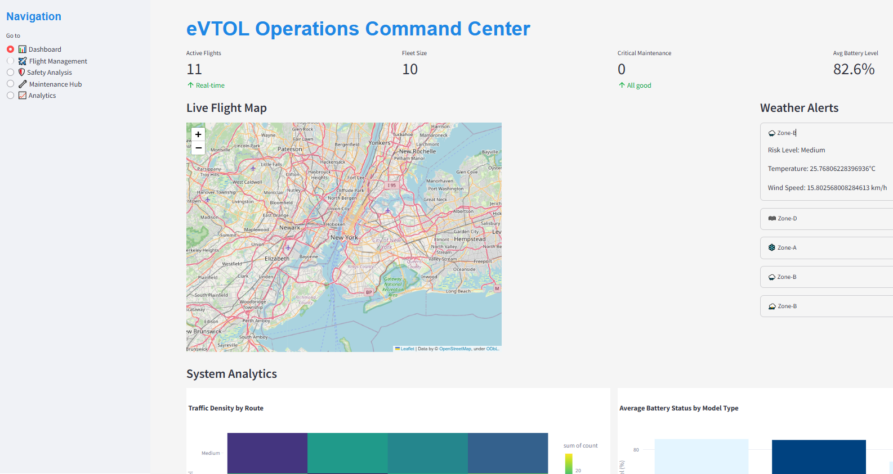
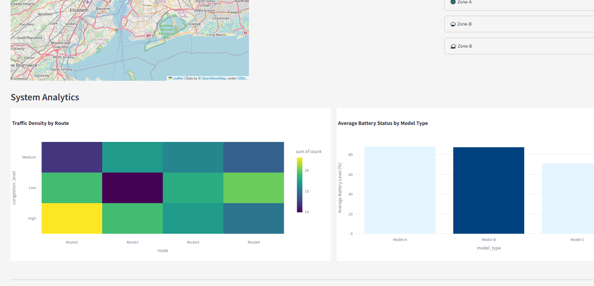
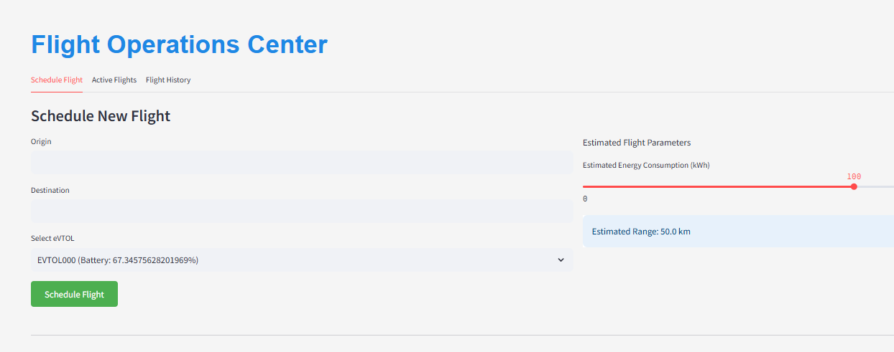
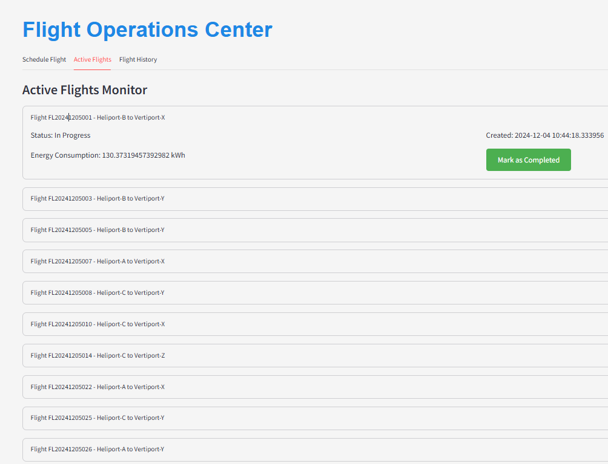
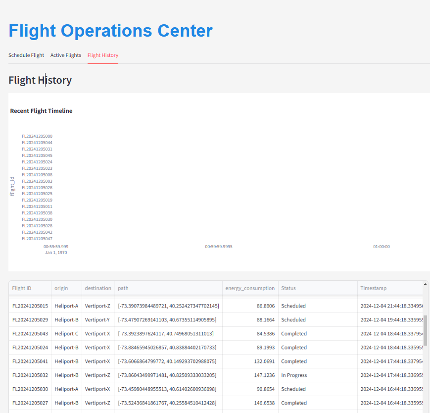
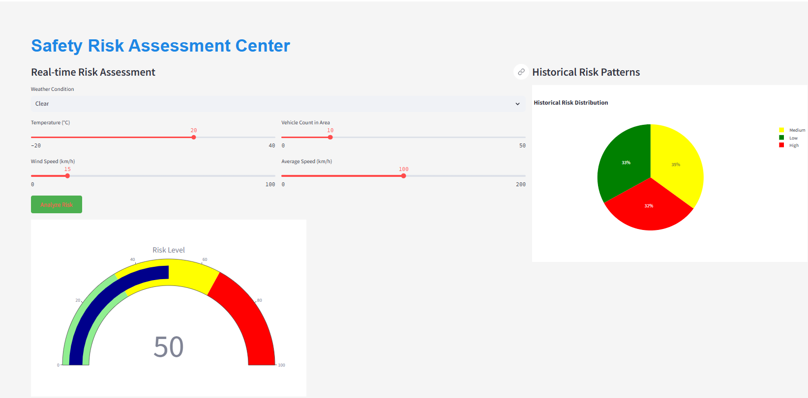
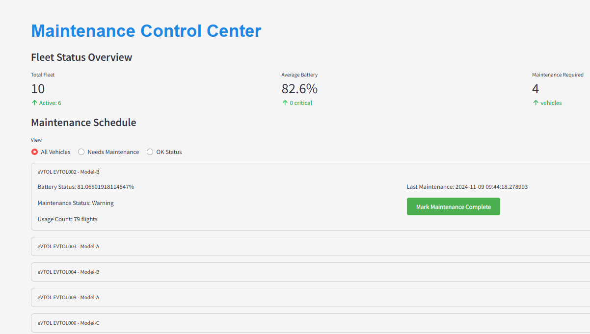
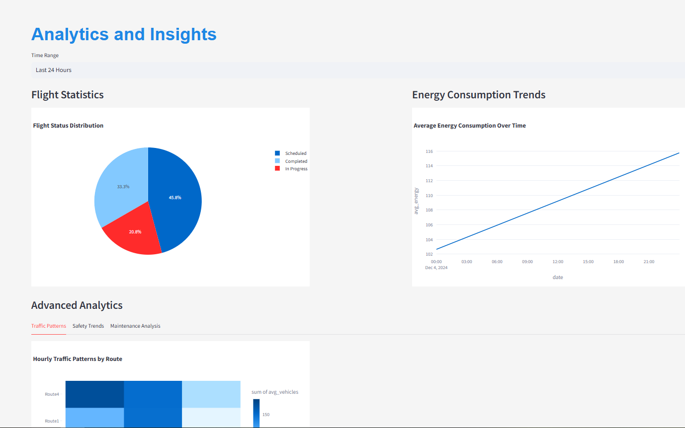

# eVTOL Smart Operations and Safety Management System


A comprehensive system for managing eVTOL (electric Vertical Take-Off and Landing) aircraft operations in urban air mobility scenarios. The system provides real-time traffic management, predictive safety alerts, and optimized energy usage monitoring through an intuitive web interface.

## 🚀 Screenshots










## 🚀 Features

### Real-time Operations
- Live flight tracking and monitoring
- Interactive map visualization
- Real-time weather alerts and risk assessment
- Traffic congestion prediction

### Safety Management
- AI-powered risk prediction
- Weather-based safety assessment
- Maintenance tracking and scheduling
- Battery status monitoring

### Analytics & Reporting
- Flight history analysis
- Energy consumption trends
- Traffic pattern visualization
- Maintenance analytics
- Custom report generation

### Smart Dashboard
- Interactive data visualization
- Real-time metrics
- Customizable views
- Mobile-responsive design

## 🏗️ Project Structure

```
eVTOL/
├── data/                    # SQLite database and data files
├── models/                  # Trained ML models
├── src/
│   ├── database/           # Database setup and operations
│   │   ├── setup_database.py
│   │   └── populate_data.py
│   ├── models/             # ML model training scripts
│   │   ├── train_traffic_model.py
│   │   └── train_safety_model.py
│   ├── frontend/           # Streamlit dashboard
│   │   └── app.py
│   ├── api/                # Flask backend API
│   └── utils/              # Utility functions
├── tests/                  # Test files
├── requirements.txt        # Project dependencies
├── LICENSE                 # MIT license
└── README.md              # Project documentation
```

## 🛠️ Prerequisites

- Python 3.8+
- SQLite
- Git

## 📦 Installation

1. Clone the repository:
```bash
git clone https://github.com/yourusername/eVTOL.git
cd eVTOL
```

2. Create and activate virtual environment:
```bash
# Windows
python -m venv venv
venv\Scripts\activate

# macOS/Linux
python3 -m venv venv
source venv/bin/activate
```

3. Install dependencies:
```bash
pip install -r requirements.txt
```

## 🚀 Setup and Running

1. Initialize the database:
```bash
python src/database/setup_database.py
```

2. Populate with sample data:
```bash
python src/database/populate_data.py
```

3. Train the ML models:
```bash
python src/models/train_traffic_model.py
python src/models/train_safety_model.py
```

4. Start the Streamlit dashboard:
```bash
streamlit run src/frontend/app.py
```

The dashboard will be available at `http://localhost:8501`

## 📊 Dashboard Pages

1. **Command Center**
   - Real-time flight monitoring
   - Weather alerts
   - Traffic visualization
   - System metrics

2. **Flight Management**
   - Flight scheduling
   - Active flight tracking
   - Flight history
   - Route planning

3. **Safety Analysis**
   - Risk assessment
   - Weather monitoring
   - Safety predictions
   - Alert management

4. **Maintenance Hub**
   - Vehicle status
   - Maintenance scheduling
   - Battery monitoring
   - Service history

5. **Analytics**
   - Performance metrics
   - Traffic patterns
   - Energy usage
   - Custom reports

## 🔒 Security

- Database access control
- Input validation
- Error handling
- Secure API endpoints

## 🤝 Contributing

1. Fork the repository
2. Create your feature branch (`git checkout -b feature/AmazingFeature`)
3. Commit your changes (`git commit -m 'Add some AmazingFeature'`)
4. Push to the branch (`git push origin feature/AmazingFeature`)
5. Open a Pull Request

## 📝 License

This project is licensed under the MIT License - see the [LICENSE](LICENSE) file for details.

## 🙏 Acknowledgments

- Streamlit for the amazing framework
- scikit-learn for ML capabilities
- SQLite for database management
- Plotly for interactive visualizations

## 📧 Contact

Your Name - your.email@example.com
Project Link: [https://github.com/yourusername/eVTOL](https://github.com/yourusername/eVTOL) 